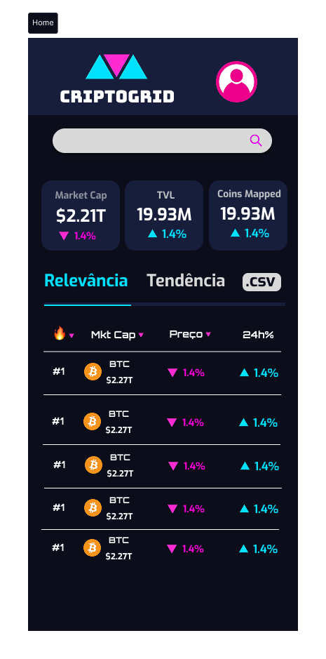
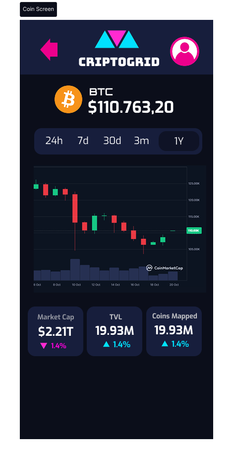
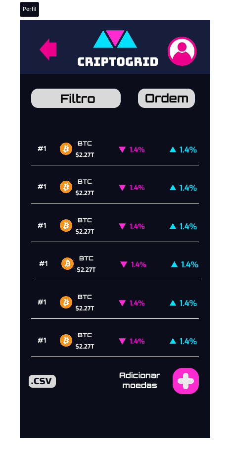
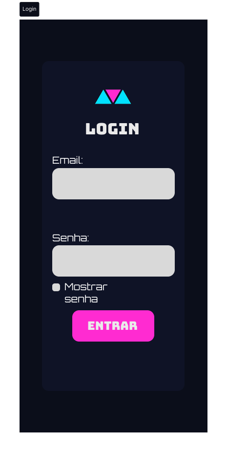

# Projeto de Interface Web

Visão geral da interação do usuário pelas telas do sistema e protótipo interativo das telas com as funcionalidades que fazem parte do sistema (wireframes) na versão web.

## Diagrama de Fluxo

## Wireframes

Atende aos RFs 05, 06, 07, 08, 09, 10, 11 e 13.

Atende aos RFs 05, 07, 09, 10, 11 e 13.

Atende aos RFs 12, 14, 15 e 17.

Atende ao RF 12.

# Projeto de Interface App
Visão geral da interação do usuário pelas telas do sistema e protótipo interativo das telas com as funcionalidades que fazem parte do sistema (wireframes) na versão App.

## Diagrama de Fluxo

## Wireframes

Atende aos RFs 05, 06, 07, 08, 09, 10, 11 e 13.

Atende aos RFs 05, 07, 09, 10, 11 e 13.

Atende aos RFs 12, 14, 15 e 17.

Atende ao RF 12.
